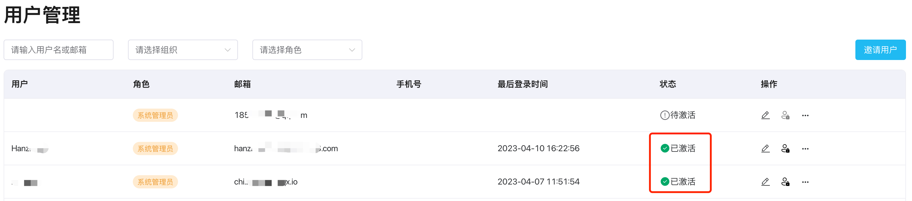

# 用户管理

通过[超级管理员账号](../install/install_ecp_on_linux.md#创建超级管理员)登录 ECP 后，即可开始进行与用户管理相关的一系列操作，比如创建用户、重置密码，[访问授权](../acl/authorize.md)、[统一认证](../acl/ecp_login.md)，审计用户的各项操作，以便及时发现和处理安全问题，保证平台的稳定和安全。

登录 ECP 平台后，在**系统管理**页面，点击左侧导航栏的**用户**即可进入**用户管理页**面。管理员可在此页面查看用户名、系统角色、邮箱、手机号、最后登录时间和账号状态是否被激活，并可以通过用户名、邮箱、所属组织和角色进行模糊搜索。

ECP 支持直接[创建用户](#创建用户)或通过[邮件邀请](#邀请用户)用户。

## 创建用户

:::tip 前置准备

请提前准备好待创建用户的邮箱地址。

:::

1. 以系统管理员的角色登录 ECP。
2. 在左侧导航栏，点击**用户管理**。
3. 点击右上角的创建用户，在随即弹出的窗口中，进入如下设置：
   - 填入用户名称，1-50 个字符，并支持"-"、"_" 和空格。
   - 填入邮箱；
   - 赋予用户角色：
     - 管理员：管理员拥有 ECP 平台的最高权限，如创建组织、项目等。
     - 普通用户：新建普通用户默认无法访问 ECP 组织或项目。关于如何授权，见[管理用户](#管理用户)或[组织与项目](./introduction.md)。
   - 按密码规则设置密码，密码至少应包含 8 个字符，应为字母、数字或符号的组合。
   - 最后，点击**确认**按钮，保存用户信息；

## 邀请用户

对于对用户名或密码要求较高的用户，ECP 支持通过邮件邀请的方式为其新建 ECP 账户。ECP 管理员同样可以通过邮件邀请的方式实现批量用户添加。

通过邮件邀请用户之前，ECP 系统管理员需要首先将用户邀请方式设为邮件邀请。

### 设置用户邀请方式

1. 以系统管理员的身份登录 ECP。
2. 在左侧导航栏，点击**系统设置** -> **通用配置**。
3. 展开**用户邀请方式管理**，点击**编辑**。
4. 将**验证方式**设为**邮件**。
5. 设置**邀请邮件有效期**和**密码重置有效期**，也可保留默认值。
6. 点击**确认**完成设置。

### 邀请用户

1. 以系统管理员的身份登录 ECP。
2. 在左侧导航栏，点击**用户管理**。
3. 在**用户管理**页面，点击**邀请用户**，在随即弹出的窗口中，输入待邀请的用户邮箱，最多支持输入10个邮箱地址，并设置用户角色
   - 管理员：管理员拥有 ECP 平台的最高权限，如创建组织、项目等。
   - 普通用户：新建普通用户默认无法访问 ECP 组织或项目。关于如何授权，见[管理用户](#管理用户)或[组织与项目](./introduction.md)。

4. 点击**邀请用户**，发送邀请邮件。

5. 返回**用户管理**页面，此时被邀请用户将被添加到用户列表中，状态为**待激活**。待被邀请用户完成邮件激活，并设置**用户名、密码**后，状态将显示为**已激活**；

   

   

## 管理用户

在**用户管理**列表页，系统管理员可以通过**操作**栏下的按钮对用户进行编辑、启用/禁用、重置密码、添加到组织、或删除等操作。

- 编辑用户：点击编辑图标，即可修改用户名、系统角色等信息。
- 启用/禁用：点击启用/禁用图标禁用/启用某账户。当用户账户被禁用后，将无法再登录 ECP 平台或使用任何平台功能。如该用户已被添加到组织，禁用该用户可能影响组织的正常运行，请谨慎操作。
- 更多操作：点击更多图标，可执行重置密码、将用户添加到组织、或删除操作。注意：用户账户删除后将无法恢复，请谨慎操作。

