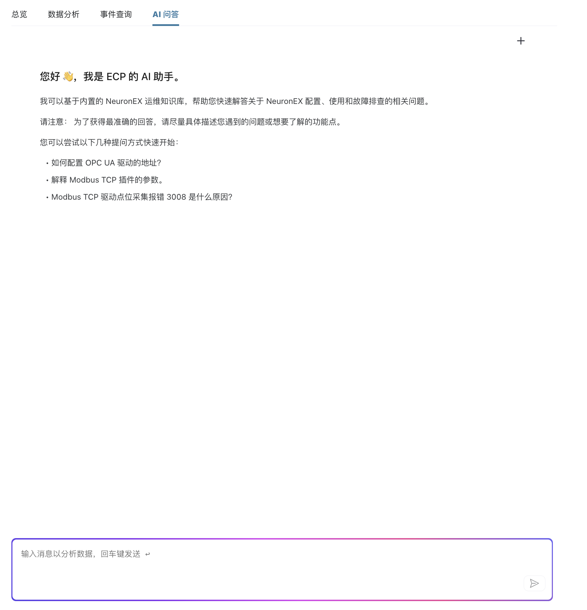
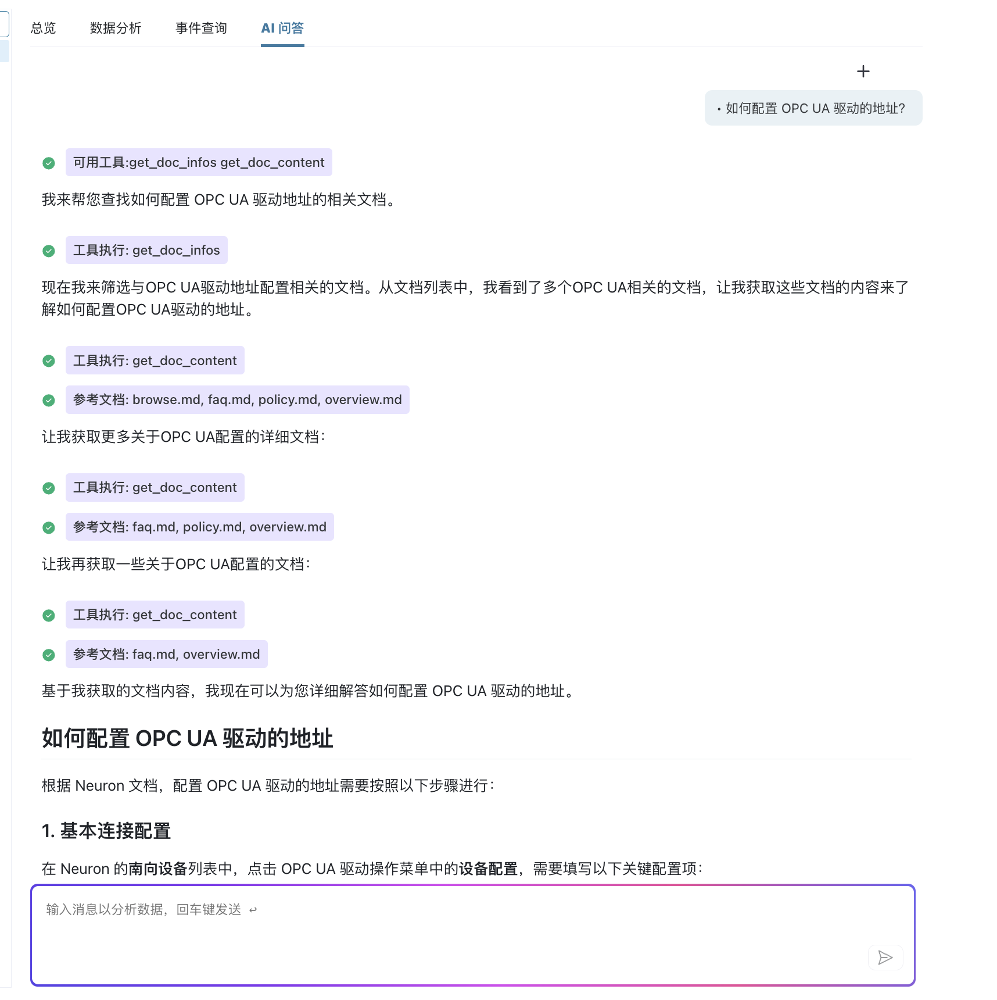

# AI 问答

ECP AI 问答功能是一个智能化的技术支持和问题解答助手，基于内置的 NeuronEX 运维知识库，为用户提供关于 NeuronEX 配置、使用和故障排查的专业指导。通过自然语言交互，您可以快速获得准确的技术解答和操作建议。

## 功能概述

AI 问答助手集成了丰富的 NeuronEX 技术文档和运维知识，能够理解用户的技术问题并提供详细的解答。无论是新手入门还是高级配置，AI 助手都能为您提供专业的技术支持。

### 核心能力

- **智能问答**：基于自然语言理解，准确识别用户问题并提供专业解答
- **知识检索**：从海量技术文档中快速定位相关信息
- **上下文理解**：结合用户的具体环境和需求，提供个性化建议
- **实时学习**：持续更新知识库，确保信息的准确性和时效性

## 界面介绍

### 欢迎界面

AI 助手以友好的方式欢迎用户，并提供清晰的功能说明：

**欢迎信息**：
- 问候语：`您好 👋, 我是 ECP 的 AI 助手。`
- 能力介绍：基于内置的 NeuronEX 运维知识库，帮助解答配置、使用和故障排查问题
- 使用建议：为了获得最准确的回答，请尽量具体描述您遇到的问题或想要了解的功能点

### 建议问题

AI 助手提供三个典型的示例问题，帮助用户快速上手：

1. **如何配置 OPC UA 驱动的地址？**
   - 适用于：OPC UA 协议配置问题
   - 涵盖：连接参数、地址格式、认证配置等

2. **解释 Modbus TCP 插件的参数**
   - 适用于：Modbus TCP 协议学习
   - 涵盖：参数说明、配置方法、最佳实践等

3. **Modbus TCP 驱动点位采集报错 3008 是什么原因？**
   - 适用于：故障排查和错误诊断
   - 涵盖：错误代码解释、解决方案、预防措施等

### 交互界面

**输入区域**：
- 占位符文本：`输入消息以分析数据, 回车键发送`
- 发送按钮：纸飞机图标，支持点击发送
- 快捷操作：回车键快速发送消息

**对话区域**：
- 消息气泡：用户问题和 AI 回答分别显示
- 工具调用：显示 AI 使用的文档检索工具
- 参考文档：展示 AI 引用的具体文档来源

## 智能特性

### 1. 文档检索

AI 助手能够智能检索相关技术文档：

**检索工具**：
- `get_doc_infos`：获取文档列表和基本信息
- `get_doc_content`：获取具体文档内容
- 智能筛选：根据问题关键词匹配相关文档

**检索过程**：
1. 分析用户问题，提取关键词
2. 在知识库中搜索相关文档
3. 获取文档内容并分析
4. 综合信息生成回答

## 使用方式

### 1. 直接提问

在输入框中直接输入您的问题，AI 助手会自动理解并搜索相关知识库内容。

**示例问题**：
- "如何配置 OPC UA 驱动的地址？"
- "Modbus TCP 驱动连接失败怎么办？"
- "如何优化数据采集性能？"

### 2. 选择建议问题

点击 AI 助手提供的建议问题，快速开始对话并获得相关解答。

### 3. 新对话

点击右上角的 "+" 按钮，开始新的对话主题，清空之前的对话历史。

### 4. 多轮对话

AI 助手支持上下文理解，可以基于之前的对话内容进行深入讨论。

## 使用建议

为了获得最准确的回答，建议您：

- **具体描述问题**：详细说明遇到的问题、错误信息或异常现象
- **提供上下文**：说明当前使用的版本、配置信息和环境情况
- **分步骤提问**：将复杂问题分解为多个简单问题，逐步深入讨论

## 知识库范围

AI 助手基于内置的 NeuronEX 运维知识库，覆盖以下领域：

- **驱动配置**：OPC UA、Modbus TCP、Siemens S7 等工业协议配置
- **故障排查**：连接问题、数据采集异常、性能优化等
- **最佳实践**：配置优化、安全设置、部署建议等

通过 ECP AI 问答功能，您可以快速获得专业的技术支持，解决 NeuronEX 配置和使用中的各种问题，提升工作效率。
