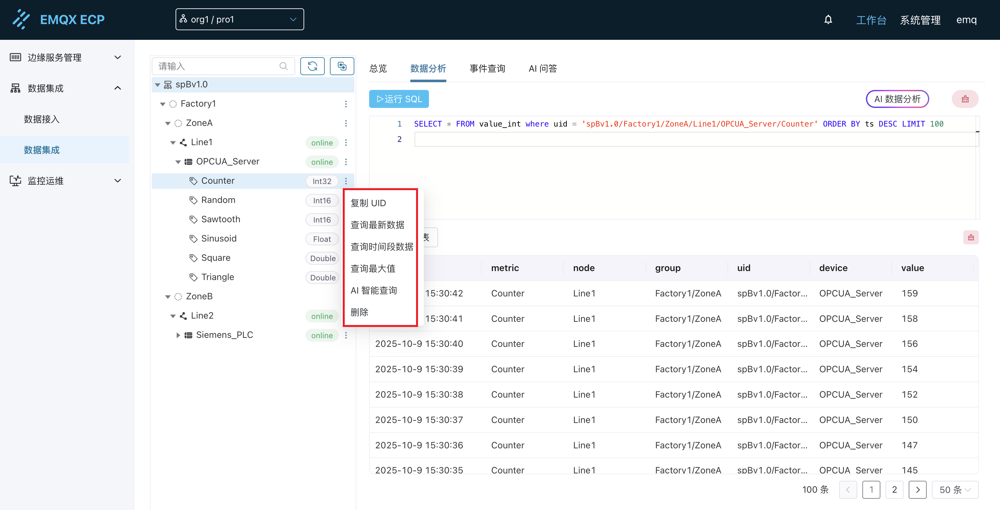

# 数据分析

ECP 数据分析功能是工业数据探索模块的核心交互界面，为您提供了从浏览数据源、构建查询到分析结果的完整工作流。与 NeuronEX 的单点数据分析不同，ECP 能够汇聚所有 NeuronEX 实例的数据，实现跨节点的统一数据分析和洞察。

## 主要功能特性


### 1. 统一入口与界面布局

**统一入口**：所有数据浏览、SQL 查询及结果展示功能均整合在统一的"数据分析"页面内。

**清晰布局**：页面采用三栏式布局：
- **左侧数据源导航区**：以树形结构展示所有 NeuronEX 实例的工业数据建模信息
- **右上 SQL 输入与配置区**：用于编写和执行 SQL 查询
- **下方结果展示区**：显示查询结果（表格或图表）

### 2. 数据源树形目录

**结构化展示**：左侧以树形结构清晰列出所有 NeuronEX 实例中的虚拟节点、边缘节点、设备节点以及具体的数据点位。

**类型显示**：每个点位后会明确标注其在 Datalayers 中存储的数据类型（例如：Int32、Float、Bool、String），帮助用户构建正确的查询。

**便捷操作**：
- **刷新**：支持手动刷新树形目录，获取最新的节点和点位信息
- **点位搜索**：提供点位名称搜索功能，快速定位目标点位
- **切换别名**：可在原始名称和自定义别名之间切换显示

**SQL 查询示例**：选中某个数据点位后，系统会自动提供常用 SQL 查询示例：
- **查询最新数据**：查询该点位的最近数据
- **查询时间段数据**：查询该点位指定时间范围内的数据
- **查询最大值**：查询该点位的最大值
- **AI 智能查询**：通过自然语言生成复杂查询



### 3. 智能 SQL 输入区

**辅助编写**：
- **关键字提示**：输入 SQL 时，提供常见的 SQL 关键字自动补全提示
- **语法高亮**：对 SQL 语句进行语法高亮，提高可读性
- **行号显示**：便于定位和调试

**查询限制**：
- **单条查询**：目前支持执行单条 SQL 查询语句
- **查询类限定**：仅接收查询类 SQL 语句（SELECT）。为保证数据安全和系统稳定，不支持 CREATE TABLE、INSERT、DELETE、UPDATE 等数据定义或修改操作

### 4. 结果展示区

**多视图展示**：每个成功执行的 SQL 查询结果，都会在该区域以表格（Table）或图表（Chart）的形式进行展示。

**表格（Table）显示**：
- 默认展示方式，以行列结构清晰呈现查询返回的数据
- 支持分页、排序等基本表格操作
- 显示数据条数和分页信息

**图表（Chart）显示**：
- **支持条件**：如果 SQL 查询结果中包含时间戳字段和数值字段，系统会自动支持将结果切换到图表视图
- **图表类型**：
  - 折线图（Line Chart）：适用于展示时序数据的趋势变化
  - 柱状图（Bar Chart）：适用于比较不同类别或时间点的数据量
- **交互功能**：
  - 图表缩放：支持对图表进行局部放大查看细节
  - 保存下载：支持将当前图表保存为图片文件（如 PNG）下载到本地
  - 图例交互：点击图例可以显示/隐藏对应的系列，方便聚焦分析


### 5. AI 数据分析助手集成

"数据分析"页面深度集成了 AI 数据分析助手，旨在帮助用户更轻松地构建和优化 SQL 查询。

**UI 入口**：
- 通过页面右上角的"AI 数据分析"按钮，点击可打开 AI 交互对话框
- 点位操作项中也提供了"AI 智能查询"的快捷入口

**AI 交互框**：
- **默认页面引导**：当从主入口打开 AI 对话框时，会提供引导性提示，告知用户 ECP 按数据类型分表存储（value_int、value_float、value_bool、value_string），并建议用户在提问时提供点位 UID 和数据类型
- **点位上下文预填充**：从点位"AI 智能查询"入口进入时，点位 UID 和对应的数据表信息会自动预填充到对话框或作为上下文传递

**AI 核心能力**：
- **自然语言转 SQL**：将用户的自然语言查询需求转换为正确的 SQL 语句
- **SQL 迭代修正**：当生成的 SQL 执行出错时，AI 能够智能分析错误原因，并进行多轮迭代修正，直至生成可成功执行的 SQL
- **跨节点分析**：支持分析来自多个 NeuronEX 实例的数据，提供全局视角的数据洞察


## 数据表结构说明

ECP 数据集成功能按数据类型将点位数据存储到不同的数据表中：

| 数据类型 | 存储表名 | 说明 |
|----------|----------|------|
| Int16/Int32/Int64 | value_int | 整数类型数据 |
| Float/Double | value_float | 浮点数类型数据 |
| Bool | value_bool | 布尔类型数据 |
| String | value_string | 字符串类型数据 |

**通用字段说明**：
- `uid`：点位的唯一标识符
- `ts`：数据时间戳
- `value`：数据值

## 使用示例

### 基础查询示例

**查询单个点位的最新100条数据**：
```sql
SELECT * FROM value_int 
where uid = 'spBv1.0/Factory1/ZoneA/Line1/OPCUA_Server/Counter' 
ORDER BY ts DESC 
LIMIT 100
```

## 使用前提

- ECP 数据集成功能已正确配置并连接 EMQX
- 至少有一个 NeuronEX 实例正在上报数据
- Datalayers 数据库正常运行并存储了历史数据
- 若需使用 AI 查询功能，请确保 AI 相关服务和模型已正确配置

## 最佳实践

1. **数据查询优化**：
   - 合理使用时间范围过滤，避免查询过大的数据集
   - 利用点位 UID 进行精确查询，提高查询效率
   - 使用 LIMIT 限制返回结果数量

2. **跨节点分析**：
   - 利用 UID 的层次结构进行分组聚合
   - 关注不同工厂、区域、产线的数据对比
   - 建立标准化的数据命名规范

3. **AI 助手使用**：
   - 提供清晰的数据分析需求描述
   - 结合具体的业务场景和指标
   - 利用 AI 生成复杂的数据分析查询

通过 ECP 数据分析功能，您可以充分利用 SQL 的强大能力和 AI 的智能辅助，深入探索来自多个 NeuronEX 实例的工业数据，获得全局性的数据洞察和业务价值。