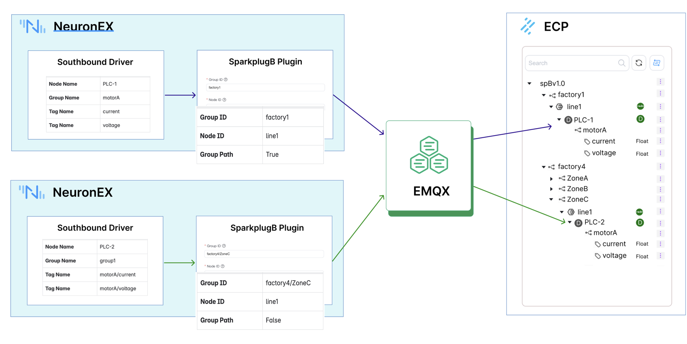

# 配置指南

本章节将指导您完成 ECP 数据集成功能的全部配置，实现从 NeuronEX 到 ECP 的数据贯通。

## 前提条件
ECP v2.7.0 或更高版本已成功部署。
一个正在运行的 EMQX 实例（EMQX v4 或 v5 版本皆可）。
至少一个正在运行的 NeuronEX 实例（v3.6.2 或更高版本），且可以与 EMQX 实例正常通信。

## 第一步：原理介绍

在配置之前，必须先规划好您的 UNS 主题结构。一个清晰的结构是后续所有功能正常运行的基础。我们采用 SparkplugB 规范，其主题结构为：

Group ID: 代表一个逻辑分组，例如一个工厂或一个区域。例如: MyFactory。

Edge Node ID: 代表一个 NeuronEX 实例。例如: ProductionLine1。

Device ID: 代表连接到 NeuronEX 的一个具体设备。例如: PackagingMachine。

示例: spBv1.0/MyFactory/NDATA/ProductionLine1/PackagingMachine

2.3. 第二步：在 ECP 中配置数据集成
登录 ECP 平台，导航至 数据集成 -> 配置 页面。

配置 MQTT Broker:

Broker 地址: 填入您 EMQX 实例的访问地址（例如 tcp://192.168.1.100:1883）。

客户端 ID: ECP 连接 Broker 所使用的客户端ID，保持默认或自定义。

用户名/密码: 如果您的 EMQX 开启了认证，请填入正确的凭据。

点击 连接测试，确保 ECP 可以成功连接到 EMQX。

保存配置。ECP 将自动订阅 spBv1.0/# 主题，以接收所有符合规范的数据。

2.4. 第三步：配置 NeuronEX SparkplugB 北向应用
登录您的 NeuronEX 实例。

在 北向应用 模块中，添加一个新的 SparkplugB 应用。

配置 Broker 连接:

服务器地址: 填入与 ECP 中相同的 EMQX Broker 地址。

用户名/密码: 填入连接 EMQX 的凭据。

配置 SparkplugB 参数 (关键步骤):

Group ID: 填入您在第一步规划的组ID，例如 MyFactory。

Node ID: 填入代表此 NeuronEX 实例的节点ID，例如 ProductionLine1。

确保 Group Path 选项设置为 True，这样 ECP 才能正确解析层级结构。

启动该应用。

在 订阅 页面，将您需要上报的南向设备采集组订阅到此 SparkplugB 应用中。NeuronEX 会自动将这些设备作为 Device 在 Node 下上报。

2.5. 第四步：验证数据接入
返回 ECP 平台。

导航至 数据集成 -> UNS 总览 页面。

稍等片刻，您应该能在左侧的树状结构中看到您刚刚配置的 MyFactory -> ProductionLine1 以及其下的设备和数据点位，并且它们的在线状态图标应为绿色。

至此，您的数据集成链路已成功建立。