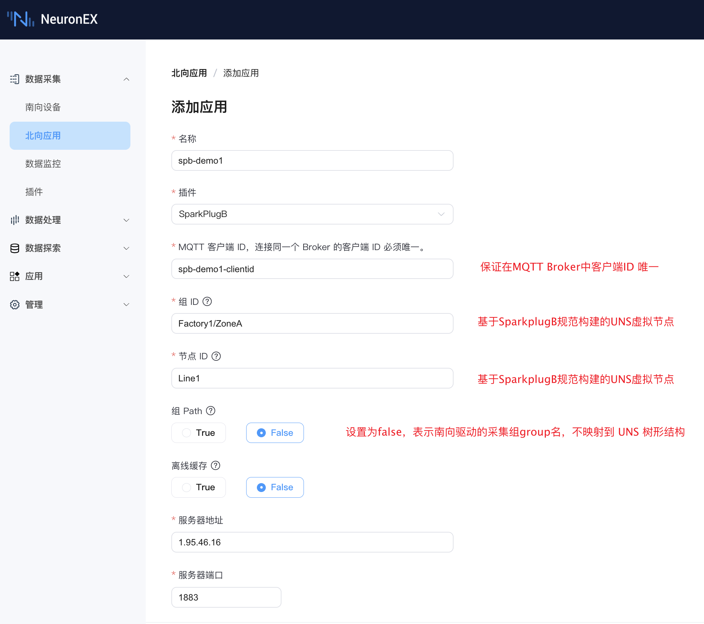

# 配置指南

本章节将指导您完成 ECP 数据集成功能的全部配置，实现从 NeuronEX 到 ECP 的数据贯通。

## 前提条件

- ECP v2.7.0 或更高版本已成功部署。
- 一个正在运行的 EMQX 实例（EMQX v4 或 v5 版本皆可）。
- 至少一个正在运行的 NeuronEX 实例（v3.6.2 或更高版本），且可以与 EMQX 实例正常通信。

通过在 NeuronEX 添加北向插件 SparkplugB，在 SparkplugB 插件中订阅多个南向驱动的采集组信息，并配置好 [Group ID、Node ID 和 Group Path](./introduction.md#neuronex-北向插件-sparkplugb-介绍)参数，将数据发送到 EMQX，然后通过 ECP 订阅所有符合规范的数据，实现数据贯通。

## 第一步：ECP 数据集成功能基础配置

在本步骤中，我们配置好 ECP 数据集成功能的基础配置，包括 EMQX 连接信息和数据存储信息。

在部署好 ECP 后（>= v2.7.0），登录 ECP 平台，创建好组织和项目后，进入到项目下的数据集成页面。

首先，需要配置 EMQX 连接信息。参考上图，NeuronEX 的 SparkplugB 插件会将点位数据发送到 MQTT Broker（EMQX），因此需要在 ECP 中配置 EMQX 的连接信息，用于获取边缘节点 NeuronEX 上报的点位数据。ECP 会自动订阅 `spBv1.0/#` 主题，以接收所有符合规范的数据。

测试连接正常后，点击确认。

默认状态下，ECP 已经内置好了单节点的 Datalayers 数据库，并已处于连接状态，会将接收到的 MQTT 数据存储到 Datalayers 数据库中，无需修改配置。当需要外置多节点 Datalayers 数据库时，可以点击编辑按钮，配置 Datalayers 数据库的连接信息。

在本步骤中，配置好 MQTT Broker 和数据存储后，我们就可以进行第二步，在 NeuronEX 中配置数据上报功能。

## 第二步：在 NeuronEX 中配置数据上报功能，ECP 中自动建立树形结构

**1. 在 NeuronEX 中配置南向驱动**

我们登录已经部署好的 NeuronEX 3.6.2 或更高版本实例，点击**数据采集** -> **南向设备**，进入南向设备页面。添加 2 个南向驱动，分别连接外部的 OPCUA 模拟器和 ModbusTCP 模拟器。

其中，OPCUA 驱动有一个采集组 `g1`，采集组下有 6 个点位，如下图所示：

ModbusTCP 驱动有一个采集组 `group1`，采集组下有 3 个点位：`MotorA/Current`、`MotorA/Voltage`、`MotorA/Power`，如下图所示：

::: tip

后续在 ECP 树形结构页面，可以看到点位 `MotorA/Current` 会将 `MotorA` 映射为虚拟节点。

:::

**2. 在 NeuronEX 中配置第一个 SparkplugB 北向应用**

在**数据采集** -> **北向应用**页面，点击**添加应用**，添加第一个 SparkplugB 应用。以下是 NeuronEX 中 “北向应用 / 添加应用” 界面的配置内容：

- **基础信息**
  - 名称 (Name): spb-demo1
  - 插件 (Plugin): SparkPlugB
  - MQTT 客户端 ID (MQTT Client ID): spb-demo1-clientid

- **SparkplugB 节点标识符**
  - 组 ID (Group ID): Factory1/ZoneA。说明：这是基于 SparkplugB 规范构建的 UNS 虚拟节点（组 ID）。
  - 节点 ID (Node ID): Line1。说明：这是基于 SparkplugB 规范构建的 UNS 虚拟节点（节点 ID）。
  - 组 Path (Group Path): False。说明：设置为 False，表示南向驱动的采集组名不映射到 UNS 树形结构。
  - 离线缓存 (Offline Caching): False

- **服务器连接信息**
  - 服务器地址 (Server Address): 1.95.46.16。请输入您自己的 EMQX 实例的访问地址，注意，此地址需要和第一步中配置的 EMQX 连接信息中的服务器地址一致。
  - 服务器端口 (Server Port): 1883
  - 用户名/密码：如果您的 EMQX 开启了认证，请填入正确的凭据。

将南向驱动 OPCUA_Server 添加订阅到此 SparkplugB 应用中。

添加完成后，可在 ECP 的树形结构页面看到 Factory1、ZoneA、Line1、OPCUA_Server 等多个节点，并且 Line1 节点表示北向 spb-demo1 节点的状态为 online，OPCUA_Server 节点表示南向驱动 OPCUA_Server 的状态为 online。

**3. 在 NeuronEX 中配置第二个 SparkplugB 北向应用**

在**数据采集** -> **北向应用**页面，点击**添加应用**，添加第二个 SparkplugB 应用。以下是 NeuronEX 中 “北向应用 / 添加应用” 界面的配置内容：

- **基础信息**
  - 名称 (Name): spb-demo2
  - 插件 (Plugin): SparkPlugB
  - MQTT 客户端 ID (MQTT Client ID): spb-demo2-clientid

- **SparkplugB 节点标识符**
  - 组 ID (Group ID): Factory1/ZoneB。说明：这是基于 SparkplugB 规范构建的 UNS 虚拟节点（组 ID）。
  - 节点 ID (Node ID): Line2。说明：这是基于 SparkplugB 规范构建的 UNS 虚拟节点（节点 ID）。
  - 组 Path (Group Path): False。说明：设置为 False，表示南向驱动的采集组名不映射到 UNS 树形结构。
  - 离线缓存 (Offline Caching): False

- **服务器连接信息**
  - 服务器地址 (Server Address): 1.95.46.16。请输入您自己的 EMQX 实例的访问地址，注意，此地址需要和第一步中配置的 EMQX 连接信息中的服务器地址一致。
  - 服务器端口 (Server Port): 1883
  - 用户名/密码：如果您的 EMQX 开启了认证，请填入正确的凭据。

将南向驱动 ModbusTCP 添加订阅到此 SparkplugB 应用中。

添加完成后，可在 ECP 的树形结构页面完整看到 NeuronEX 中 2 个 SparkplugB 应用的树形结构。

::: tip

可以看到点位 `MotorA/Current` 会将 `MotorA` 映射为虚拟节点。通过在点位命名时增加 `/`，可以自由地将一个南向驱动下的多个点位映射为不同的虚拟节点。

:::

至此，您的数据集成链路已成功建立。您可以继续部署多套 NeuronEX，并根据业务需求，配置不同的 SparkplugB 应用中的组 ID、节点 ID、组 Path 参数，构建完整的 UNS 工业数据统一命名空间。

请浏览后续章节，了解更多关于 ECP 数据集成的配置和使用：

- [数据集成 - 总览](./overview.md)
- [数据集成 - 数据分析](./analysis.md)
- [数据集成 - 事件查询](./event.md)
- [数据集成 - AI 问答](./ai_assistant.md)

