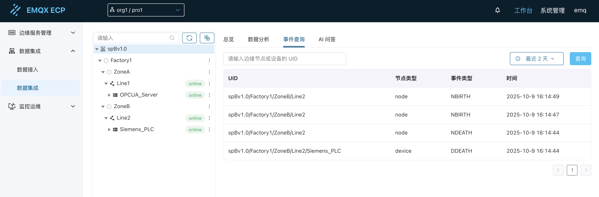

# 事件查询

ECP 事件查询功能基于 SparkplugB 协议的生命周期消息（Birth/Death），提供对边缘节点和设备上下线状态的全面监控和历史追溯。通过统一的事件管理，您可以实时掌握整个工业数据网络中所有组件的连接状态变化。

## 功能概述

事件查询功能通过监控 SparkplugB 协议中的生命周期消息，自动记录和展示边缘节点与设备的上下线事件。这些事件信息对于设备运维、故障诊断和系统监控具有重要意义。

### 支持的事件类型

| 事件类型 | 说明 | 触发条件 |
|----------|------|----------|
| **NBIRTH** | 边缘节点上线 | NeuronEX 中的 SparkplugB 北向应用成功连接并上报节点信息 |
| **NDEATH** | 边缘节点下线 | NeuronEX 中的 SparkplugB 北向应用断开连接或异常退出 |
| **DBIRTH** | 设备上线 | 南向驱动成功连接并开始上报设备数据 |
| **DDEATH** | 设备下线 | 南向驱动断开连接或设备离线 |

## 界面布局

事件查询页面采用简洁的布局设计，主要包含以下区域：

### 查询条件区

**UID 输入框**：
- 标签：`请输入边缘节点或设备的UID`
- 功能：支持输入完整的节点或设备 UID 进行精确查询
- 示例：`spBv1.0/Factory1/ZoneB/Line2/Siemens_PLC`

**时间范围选择**：
- 提供预设时间选项：最近1天、最近2天、最近7天、最近30天
- 默认选择：最近2天
- 支持自定义时间范围选择

**查询按钮**：
- 点击执行查询操作
- 支持回车键快捷查询

### 事件列表区

以表格形式展示查询结果，包含以下列：

| 列名 | 说明 | 示例 |
|------|------|------|
| **UID** | 边缘节点或设备的唯一标识符 | `spBv1.0/Factory1/ZoneB/Line2` |
| **节点类型** | 实体类型（node/device） | `node` / `device` |
| **事件类型** | 具体的事件类型 | `NBIRTH` / `NDEATH` / `DBIRTH` / `DDEATH` |
| **时间** | 事件发生的具体时间戳 | `2025-10-9 16:14:49` |

## 查询方式

### 1. 精确查询

输入完整的边缘节点或设备 UID，查询特定实体的所有事件记录：

**查询示例**：
- 输入：`spBv1.0/Factory1/ZoneB/Line2`
- 结果：显示该边缘节点的所有上线、下线事件

### 2. 时间范围查询

选择时间范围，查询指定时间段内的所有事件：

**时间选项**：
- 最近1天：查询过去24小时的事件
- 最近2天：查询过去48小时的事件（默认）
- 最近7天：查询过去一周的事件
- 最近30天：查询过去一个月的事件

### 3. 全局查询

不输入 UID，不选择时间范围，直接点击查询按钮，可查看所有历史事件记录。

### 4. 组合查询

同时使用 UID 和时间范围条件，实现更精确的查询：

**示例场景**：
- UID：`spBv1.0/Factory1/ZoneA/Line1/OPCUA_Server`
- 时间：最近7天
- 结果：显示该设备在过去一周内的所有上下线事件

