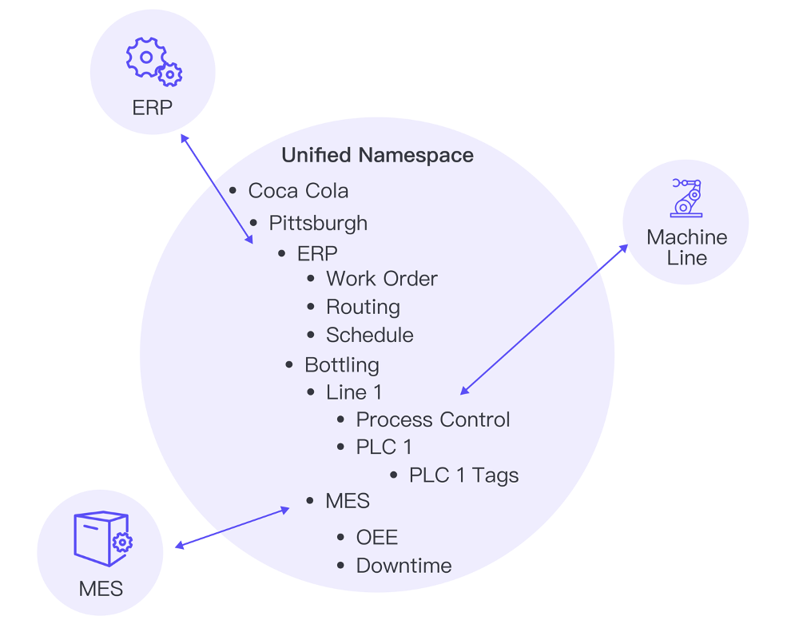
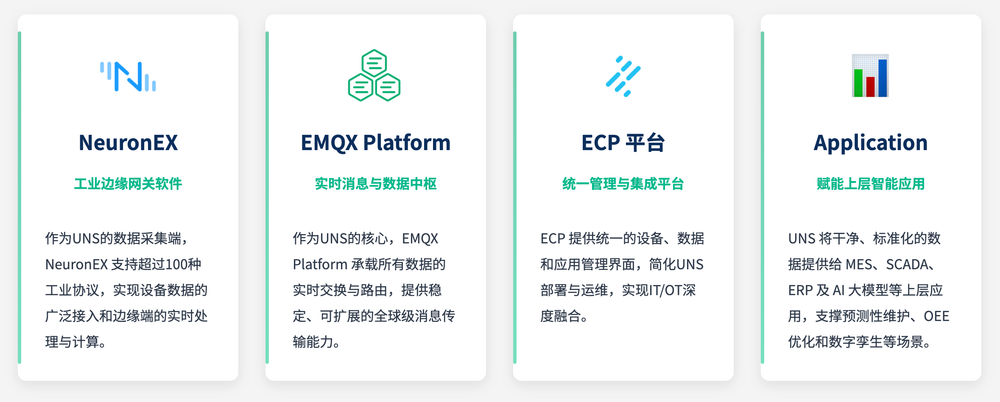
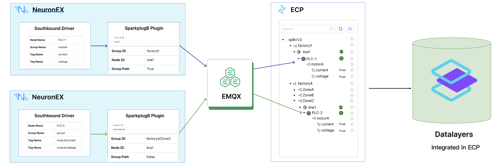
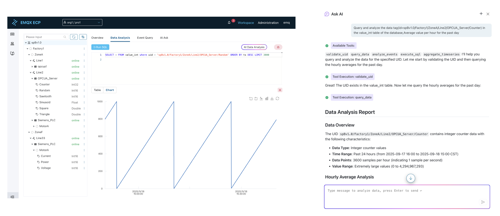
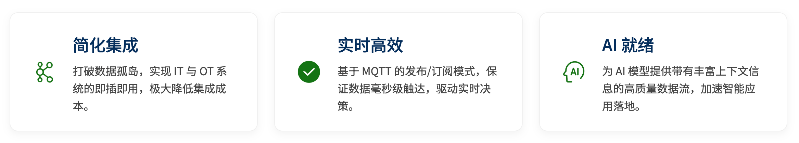

# UNS 数据集成

## 引言
在迈向工业 4.0 的征途中，我们都认同一个事实：数据是新石油。然而，对于大多数制造企业而言，这“石油”的开采和提炼过程却异常艰难。工厂里充满了来自不同年代、不同供应商的设备，它们说着各自不同的“方言”（PLC、SCADA、MES、ERP...），导致数据被困在一个个独立的系统中，形成了所谓的“数据孤岛”。

这种割裂的现状，使得 OT（运营技术）与 IT（信息技术）之间存在着一条难以逾越的鸿沟。我们无法获得一个关于工厂运营的统一、实时的全局视图，更不用说利用这些数据来驱动更高级的分析和人工智能（AI）应用了。

有没有一种架构，能够彻底打破这些壁垒，让数据自由、有序地流动起来？答案是肯定的，它就是——统一命名空间 (Unified Namespace, UNS)。

## 什么是统一命名空间 (UNS)？
统一命名空间 (UNS)是一种革命性的数据架构思想。其核心在于，将企业内所有有价值的数据和事件，按照统一的、结构化的业务逻辑（例如：企业/厂区/车间/产线/设备/参数）进行组织，汇集到一个中央数据枢纽中，从而构建起整个企业的单一事实来源 (Single Source of Truth)。

在这个架构下，任何数据生产者（如一台 CNC 机床）和数据消费者（如一个 MES 系统或一个 AI 算法）不再需要进行复杂的点对点集成。它们只需连接到这个“中央枢纽”，按照既定的“地址”发布或订阅数据即可。这极大地简化了系统集成，实现了真正的“即插即用”。

UNS 不仅仅是一种命名规范，更是一种革命性的数据架构思想，它旨在：

- **构建单一事实来源**：将企业内所有实时的、有价值的数据和事件汇聚于一个统一的、结构化的命名空间下
- **赋予数据语义与上下文**：按照业务逻辑对数据进行分层组织，使每个数据点都携带其业务含义和上下文信息
- **实现事件驱动与实时流动**：基于 MQTT 等发布/订阅协议，确保数据按需、高效、实时地在生产者和消费者之间流动
- **彻底解耦数据生产者与消费者**：无论是底层的 PLC、传感器，还是上层的 MES、ERP、BI 或 AI 应用，都可以独立地接入 UNS

<div align="center">

</div>

## 基于 UNS 的一站式解决方案
基于 UNS 架构的一站式解决方案，它包含 NeuronEX、EMQX Platform 和 ECP 管理平台以及丰富的应用接口，无缝协同，为您构建强大的工业 AI 数据中枢。

### NeuronEX：工业边缘网关软件
作为 UNS 的“数据采集触手”，边缘网关软件（如 NeuronEX）负责连接工厂车间里形形色色的工业设备。它支持采集 100+ 种工业协议（如 Modbus, OPC-UA, Siemens S7 等），将原始、晦涩的设备数据，转化为统一的、带有业务上下文的 MQTT 消息，并发布到 UNS 中。同时，它还能在边缘端进行实时的数据处理与计算，降低延迟和网络负载。

### EMQX Platform：实时消息与数据中枢
EMQX Platform是 UNS 架构的心脏。一个高性能的 MQTT 消息平台（如 EMQX Platform）承载着整个 UNS 的数据交换。它接收来自所有边缘节点的数据，并根据主题进行高效路由，确保任何授权的应用程序都能实时订阅到它们所需的数据。其高可用、高并发的特性，保证了整个工厂数据流的稳定与可靠。

**核心能力：**

- **UNS 核心消息中枢**：作为高性能、高可用的分布式 MQTT 平台
- **海量连接与高吞吐保障**：支持数百万级的并发连接和每秒数百万条消息的高吞吐
- **内置规则引擎**：对 UNS 数据流进行实时处理、转换、丰富
- **AI/大模型能力集成**：作为关键的数据管道，将结构化的 UNS 数据高效提供给 AI 分析平台

### ECP 平台：统一管理与集成平台
ECP 提供统一的设备、数据和应用管理界面，简化 UNS 部署与运维，实现 IT/OT 深度融合。

**核心能力：**

- **统一设备管理**：集中管理所有接入 UNS 的设备和系统
- **数据建模与可视化**：提供直观的数据模型管理和监控界面
- **运维管理**：简化 UNS 系统的部署、配置和日常运维
- **安全控制**：提供细粒度的访问权限控制和数据安全保障



## 基于 SparkplugB 的自动化建模
Sparkplug B 为 UNS 架构注入了“自动化”的基因。它在 MQTT 的基础上定义了一套标准，将工业数据交互的效率和可靠性提升到了新的高度，其核心优势体现在以下三点：

1. **遵循数据语义**
   按照业务逻辑（如：企业/区域/工厂/产线/设备/设备/测点）对数据进行分层组织，使每个数据点都携带业务含义。

2. **状态精准显示**
   内置“上线与离线证明”机制，能精准、实时地显示网络中每个边缘节点和设备的真实在线状态，告别状态延迟的烦恼，让监控与运维更加可靠。

3. **自动化数据持久化**
   设备接入网络后，平台可根据其上报信息，自动为其创建数据存储策略。真正实现了数据持久化的“即插即用”，无需手动配置，为后续分析奠定基础。



## 全场景数据洞察与分析
将海量工业数据有效地存储和利用，是释放其价值的最后一公里。我们的平台提供了一套完整的工具链，让从数据工程师到一线业务专家的每个人，都能轻松地从数据中获得洞察。

1. **时序数据库存储**
   平台内置了专为工业场景设计的时序数据库Datalayers。它支持使用标准SQL对海量、高频的时序数据进行高效查询与分析，为各类工业数据分析应用提供了强大的动力。

2. **智能 SQL 编辑器**
   为了提升数据查询效率，我们提供了智能SQL编辑器。它支持语法高亮和关键字自动提示，能显著减少SQL编写错误，让数据工程师和分析师的工作更加高效、准确。

3. **AI 数据分析**
   我们相信，每个人都应该能轻松利用数据。通过AI数据分析功能，您只需用自然语言描述查询需求，AI便能自动生成SQL语句，极大降低了数据分析的门槛。



## 拥抱 UNS 带来的核心优势
从传统的点对点集成，转向先进的 UNS 架构，将为您的企业带来不可估量的价值：

- **极致简化的集成**
  打破数据孤岛，实现 IT 与 OT 系统的无缝对接。增加一台新设备或一套新系统，不再需要数周的定制开发，成本和时间都得到极大节约。

- **驱动实时决策**
  基于 MQTT 的发布/订阅模式，保证了从数据产生到消费的毫秒级延迟。管理者和运营者可以基于最即时的数据做出最精准的决策。

- **为 AI 时代做好准备**
  AI 算法的成功，依赖于高质量、大规模、带有丰富上下文信息的实时数据。UNS 架构恰好是为 AI 模型量身打造的“数据饲料管道”，能够源源不断地提供高质量数据流，加速预测性维护、智能排产、数字孪生等应用的落地。



## SparkplugB 介绍

SparkplugB 是工业物联网（IIoT）领域的一种开放式通信协议规范，基于 MQTT 3.1.1 协议扩展，专为工业设备互联设计。它定义了设备与系统之间标准化的数据格式、主题命名规则和状态管理机制，解决工业场景中设备数据异构性、状态一致性等核心问题。

在 ECP 数据集成功能中，我们使用 SparkplugB 规范，其中 NeuronEX 北向使用 SparkplugB 插件进行数据上报，NeuronEX 作为 SparkplugB 的边缘节点。ECP 通过通配符 `spBv1.0/#` 订阅所有符合规范的数据，ECP 作为 SparkplugB 的应用节点。

### SparkplugB 名词定义

#### Edge Node（边缘节点）
Edge Node 是 SparkplugB 架构中的核心组件，代表一个物理或逻辑的边缘计算单元，负责连接和管理一组设备。

- **Group ID**：边缘节点所属的组标识符
  - 用于对边缘节点进行逻辑分组，通常对应工厂的物理区域或功能区域
  - 例如：`Factory_A`、`Production_Line_1`、`Warehouse_B`
  - 在同一组内的所有边缘节点共享相同的 Group ID

- **Node ID**：边缘节点的唯一标识符
  - 在同一个 Group ID 内必须唯一
  - 通常对应具体的物理设备或逻辑单元
  - 例如：`PLC_001`、`Gateway_Station_1`、`Edge_Computer_A`

#### 主题命名规则
SparkplugB 使用标准化的 MQTT 主题格式：
```
spBv1.0/{Group ID}/{Edge Node ID}/{Message Type}
```

**示例主题：**
- `spBv1.0/Factory_A/PLC_001/NBIRTH` - 节点上线消息
- `spBv1.0/Factory_A/PLC_001/DDATA` - 设备数据消息
- `spBv1.0/Production_Line_1/Gateway_Station_1/NDEATH` - 节点下线消息

### SparkplugB 核心特性

- **标准化数据模型**：
  定义设备数据的统一格式（如 Metric 结构体），包含数据类型、单位、时间戳等元数据，消除不同设备协议差异。

- **状态管理**：
  通过 Birth（设备/节点上线）和 Death（下线）消息明确设备生命周期，确保系统实时感知设备状态。

- **数据压缩与高效传输**：
  使用 Protobuf 编码压缩数据，减少网络带宽占用，适合低功耗工业设备。

- **拓扑结构支持**：
  支持层级化设备模型（如 Edge Node → Device → Metric），天然适配工厂的物理拓扑

### SparkplugB 典型消息类型

- **NBIRTH**（节点上线）、**DBIRTH**（设备上线）
- **NDATA**（节点数据）、**DDATA**（设备数据）
- **NDEATH**（节点下线）、**DDEATH**（设备下线）

