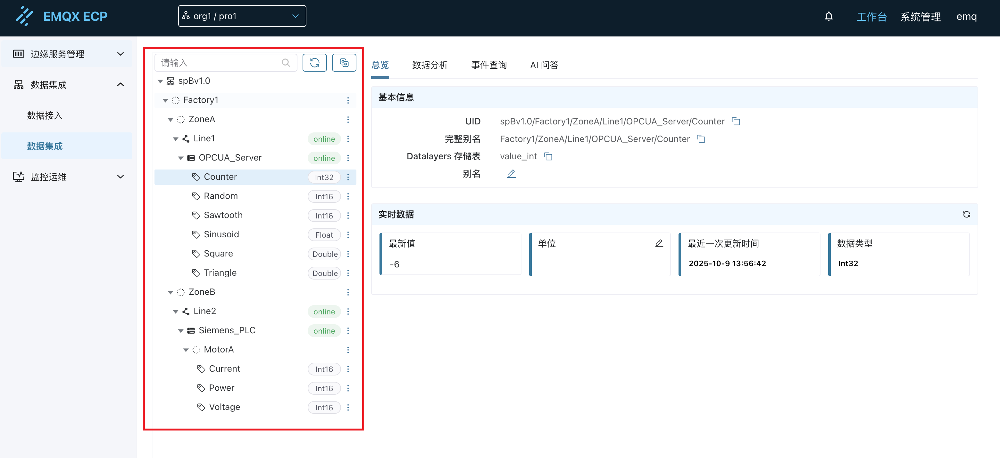
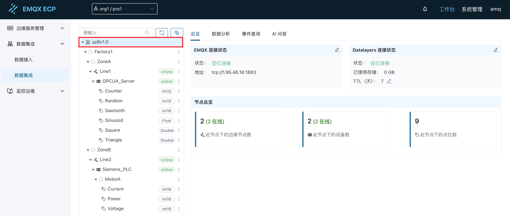
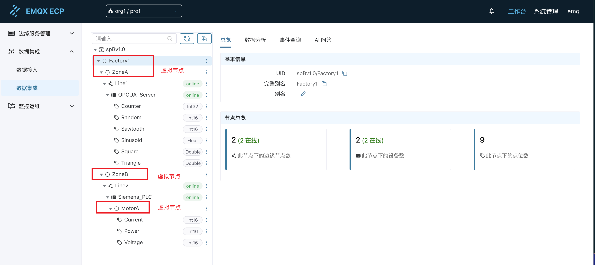
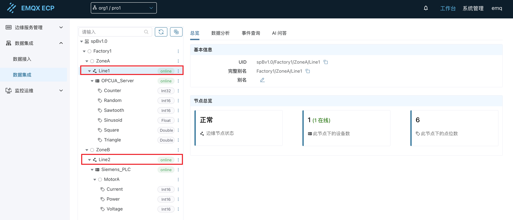
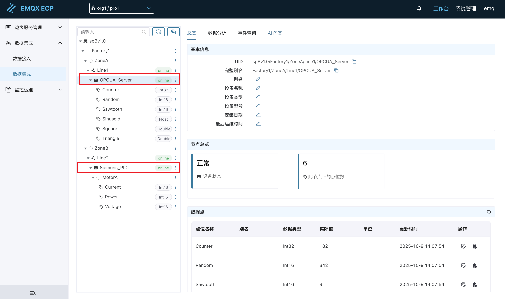
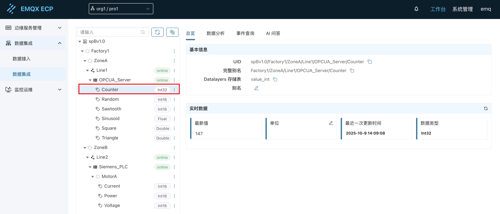

# 总览

在[数据集成 - 配置指南](./configuration.md)中，我们配置好了 ECP 数据集成功能的基础配置，包括 EMQX 连接信息和数据存储信息。在本节中，我们将介绍 ECP 数据集成功能的总览部分。

## 树形结构介绍

在数据集成页面，左侧部分固定为树形结构，用于展示具有层次结构的工业数据建模信息。



当选择某个节点时，右侧部分将展示该节点的详细信息。节点类型分为`总节点`、`虚拟节点`、`边缘节点`、`设备节点`和`点位`，具体如下：

### **总节点**

总节点表示整个工业数据建模的根节点，默认名称为 `spBv1.0`。点击该节点时，右侧部分将展示该节点的详细信息，包括 EMQX 连接状态、Datalayers 连接状态、节点总览等内容。关于 EMQX 和 Datalayers 的详细配置，请参考[配置指南](./configuration.md#第一步ecp-数据集成功能基础配置)。




### **虚拟节点**

虚拟节点有两类：
- 第一类为根据 NeuronEX 中配置的 SparkplugB 应用中的组 ID、节点 ID、组 Path 参数构建的虚拟节点。上图中的 `Factory1`、`ZoneA`、`Line1` 等节点都属于这一类。
- 第二类为根据 NeuronEX 中配置的南向驱动中的采集组、点位使用 `/` 分割的虚拟组名称构建的虚拟节点。上图中的 `MotorA` 等节点都属于这一类。

虚拟节点用于构建用户的信息模型，本身并没有 `online`、`offline` 状态。

点击该类节点时，右侧部分将展示该节点的详细信息，包括`基本信息`和`节点总览`。

- 基本信息：
  - UID：虚拟节点的唯一标识符，用于在数据集成功能中唯一标识该节点。
  - 完整别名：包含上层父节点的完整别名。
  - 别名：由用户自定义的名称。
- 节点总览：
  - 此节点下的边缘节点数：此节点下的总`边缘节点`数。
  - 此节点下的设备数：此节点下的总`设备`数。
  - 此节点下的点位数：此节点下的总`点位`数。



### **边缘节点**

NeuronEX 中配置的一个北向应用 SparkplugB 节点，对应在 ECP 中为一个边缘节点。边缘节点的 `online`、`offline` 状态与 NeuronEX 上该 SparkplugB 节点的 `online`、`offline` 状态一致。点击该类节点时，右侧部分将展示该节点的详细信息，包括`基本信息`和`节点总览`。

- 基本信息：
  - UID：边缘节点的唯一标识符，用于在数据集成功能中唯一标识该节点。
  - 完整别名：包含上层父节点的完整别名。
  - 别名：由用户自定义的名称。
- 节点总览：
  - 边缘节点状态：此节点的状态。
  - 此节点下的设备数：此节点下的总`设备`数。
  - 此节点下的点位数：此节点下的总`点位`数。



### **设备节点**

NeuronEX 中配置的一个南向驱动，对应在 ECP 中为一个设备节点。设备节点的 `online`、`offline` 状态与 NeuronEX 上该南向驱动的 `online`、`offline` 状态一致。点击该类节点时，右侧部分将展示该节点的详细信息，包括`基本信息`、`节点总览`和`数据点`。

- 基本信息：
  - UID：设备节点的唯一标识符，用于在数据集成功能中唯一标识该节点。
  - 完整别名：包含上层父节点的完整别名。
  - 别名：由用户自定义的名称。
  - 设备名称：由用户自定义的名称。
  - 设备类型：由用户自定义的类型。
  - 设备型号：由用户自定义的型号。
  - 安装日期：由用户自定义的安装日期。
  - 最后运维时间：由用户自定义的最后运维时间。
- 节点总览：
  - 设备状态：此节点的状态。
  - 此节点下的点位数：此节点下的总`点位`数。
- 数据点：
  - 以列表方式详细展示该设备节点下的所有数据点。
  - 可实时查看最新的上报值。
  - 可编辑修改点位单位信息。
  - 可通过`编辑点位值`按钮，实现对设备点位的反向控制。



::: tip
1、设备节点一定从属于一个边缘节点。

2、必须在 SparkplugB 应用中，将该南向驱动添加订阅到该应用中，才能在 ECP 中看到该设备节点。
:::

### **点位**

点位为 NeuronEX 南向驱动中的一个数据点，对应在 ECP 中为一个点位。点位的数据类型为 SparkplugB 传输过程中所使用的数据类型。点击该类节点时，右侧部分将展示该节点的详细信息，包括`基本信息`和`实时数据`。

- 基本信息：
  - UID：点位的唯一标识符，用于在数据集成功能中唯一标识该节点。
  - 完整别名：包含上层父节点的完整别名。
  - Datalayers 存储表：该点位在 Datalayers 数据库中的存储表名称。
  - 别名：由用户自定义的名称。
- 实时数据：
  - 展示该点位的最新值、单位、最近一次更新时间、数据类型等信息。



## 树形结构功能

在树形结构上部，有`查询`、`刷新`、`切换别名`等多个功能按钮。

### 查询

输入节点名称，可查询过滤树形结构中的节点。

### 刷新

点击该按钮可刷新树形结构，查看最新的树形结构信息、节点状态等。

### 切换别名

点击该按钮可切换树形结构中节点的显示名称。默认显示 NeuronEX 中定义的节点名称，包括组 ID、节点 ID、南向驱动名称、点位名称等。点击后可切换为用户自定义的别名。

### 节点删除

ECP 支持对测试或不再使用的节点进行删除操作。删除操作仅在 ECP 中移除节点信息，不会影响 NeuronEX 的运行状态。

#### 删除规则

不同类型的节点有不同的删除条件：

**根节点（spBv1.0）**
- 不可删除

**第一类虚拟节点**（根据 SparkplugB 应用配置生成的节点）
- 删除条件：该节点下没有边缘节点，或所有边缘节点均处于离线状态
- 删除范围：删除该节点及其所有子节点和点位信息

**第二类虚拟节点**（根据南向驱动采集组和点位名称生成的节点）和**点位节点**
- 可随时删除

**边缘节点**和**设备节点**
- 删除条件：节点必须处于离线状态
- 在线时不可删除

#### 删除影响

删除节点后，将产生以下影响：

1. **自动清理关联信息**：
   - 删除该节点的别名信息
   - 删除用户自定义的设备信息
   - 删除该节点绑定的标签

2. **历史数据保留**：
   - Datalayers 数据库中的历史数据不会被删除。历史数据会根据 Datalayers 的 TTL 设置自动删除。

3. **数据重新上报**：
   - 如果 NeuronEX 重新连接并上报了相同的节点或点位信息，这些节点将重新出现在树形结构中。

## 点位控制

ECP 数据集成功能支持通过多种方式对设备点位进行反向控制（写入操作）。

### 界面控制

在树形结构中选择单个点位，点击`编辑点位值`按钮，即可直接修改该点位的值，实现对设备的实时控制，详细操作参考[点位](#点位)。

### API 控制

ECP 提供了 RESTful API 接口，支持通过编程方式对设备点位进行控制。该接口支持单点位和多点位批量控制，多个点位可分属于不同的南向驱动。

**接口信息**

- **接口路径**：`/api/sparkplug/metrics/metric/values`
- **请求方法**：PUT
- **Content-Type**：application/json

**请求参数说明**

| 参数名 | 类型 | 必填 | 说明 |
|--------|------|------|------|
| metrics | Array | 是 | 点位控制数组 |
| metrics[].id | String | 是 | 点位的唯一标识符（UID） |
| metrics[].value | Any | 是 | 要写入的点位值，类型应与点位数据类型匹配 |

**请求示例**

```json
{
  "metrics": [
    {"id": "spBv1.0/Factory1/ZoneB/Line2/Siemens_PLC/MotorA/Current", "value": 11},
    {"id": "spBv1.0/Factory1/ZoneB/Line2/Siemens_PLC/MotorA/Voltage", "value": 22},
    {"id": "spBv1.0/Factory1/ZoneA/Line1/OPCUA_Server/Counter", "value": 33}
  ]
}
```

**响应参数说明**

| 参数名 | 类型 | 说明 |
|--------|------|------|
| results | Array | 点位控制结果数组 |
| results[].id | String | 点位的唯一标识符（UID） |
| results[].success | Boolean | 控制操作是否成功 |

**响应示例**

```json
{
    "results": [
        {
            "id": "spBv1.0/Factory1/ZoneB/Line2/Siemens_PLC/MotorA/Current",
            "success": true
        },
        {
            "id": "spBv1.0/Factory1/ZoneB/Line2/Siemens_PLC/MotorA/Voltage",
            "success": true
        },
        {
            "id": "spBv1.0/Factory1/ZoneA/Line1/OPCUA_Server/Counter",
            "success": true
        }
    ]
}
```


### MQTT 控制

ECP 支持通过 MQTT 消息对设备点位进行控制。用户需要向指定的 MQTT 主题发布控制消息，ECP 接收后将执行相应的控制操作。

**MQTT 主题**

- **订阅主题**：`ecp/device_control`

**消息格式说明**

| 参数名 | 类型 | 必填 | 说明 |
|--------|------|------|------|
| metrics | Array | 是 | 点位控制数组 |
| metrics[].id | String | 是 | 点位的唯一标识符（UID） |
| metrics[].value | Any | 是 | 要写入的点位值，类型应与点位数据类型匹配 |

**发布消息示例**

```json
{
  "metrics": [
    {"id": "spBv1.0/Factory1/ZoneB/Line2/Siemens_PLC/MotorA/Current", "value": 11},
    {"id": "spBv1.0/Factory1/ZoneB/Line2/Siemens_PLC/MotorA/Voltage", "value": 22},
    {"id": "spBv1.0/Factory1/ZoneA/Line1/OPCUA_Server/Counter", "value": 33}
  ]
}
```

**响应说明**

ECP 处理控制消息后，会向响应主题发布执行结果。响应消息包含每个点位的控制状态。

**响应参数说明**

| 参数名 | 类型 | 说明 |
|--------|------|------|
| results | Array | 点位控制结果数组 |
| results[].id | String | 点位的唯一标识符（UID） |
| results[].success | Boolean | 控制操作是否成功 |

**响应消息示例**

```json
{
  "results": [
    {
      "id": "spBv1.0/Factory1/ZoneB/Line2/Siemens_PLC/MotorA/Current",
      "success": true
    },
    {
      "id": "spBv1.0/Factory1/ZoneB/Line2/Siemens_PLC/MotorA/Voltage",
      "success": true
    },
    {
      "id": "spBv1.0/Factory1/ZoneA/Line1/OPCUA_Server/Counter",
      "success": true
    }
  ]
}
```