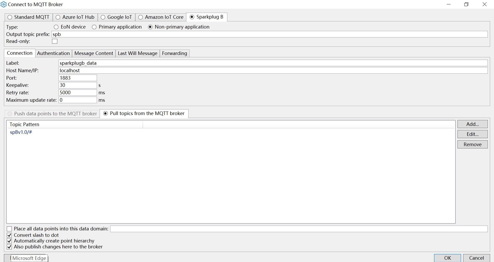
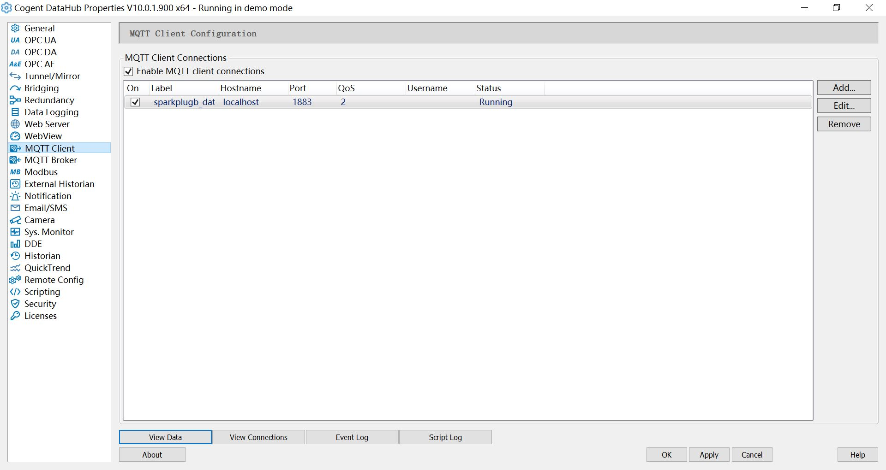
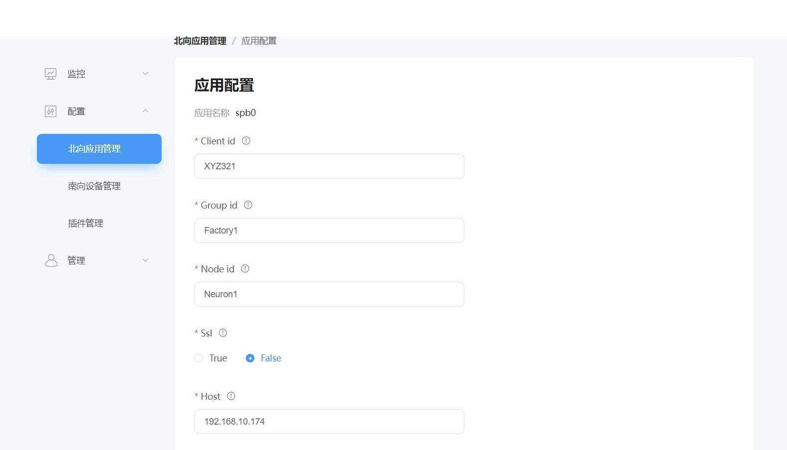
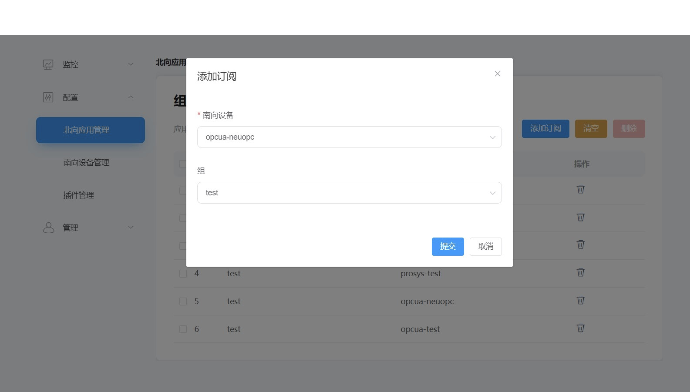
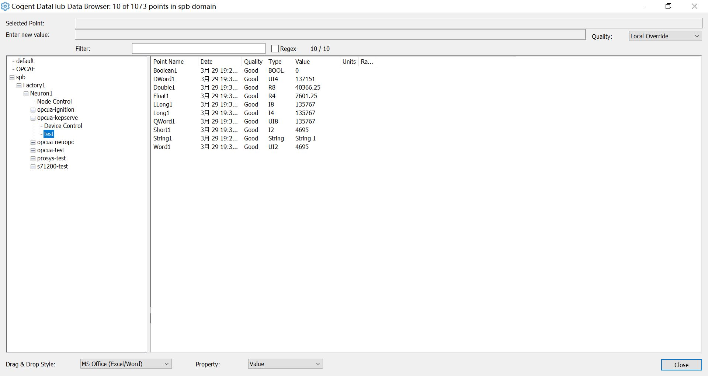

# 连接 Cogent

## Cogent 设置

1. 从 Cogent 官网下载 CogentDataHub 安装包，按照官方文档进行安装。

2. 本机启动一个 EMQX broker 实例，启动命令：`./bin/emqx start`。

3. 右键点击系统托盘中的 Cogent 图标，打开 **Cogent DataHub**。

4. 打开 **MQTT Broker**，取消选择 `Enable MQTT Broker`。

5. 打开 **MQTT Client**, 选择 `Enable MQTT client connections`，点击 `Add` 按钮添加一个新的连接，选择 **Sparkplug B**，设置 `Type` 为 `Non-primary application`，设置 `Host Name/IP` 为 `localhost`，设置 `Port` 为 `1883`。

## ECP Edge 设置

1. 在 ECP Edge **北向应用管理** 中添加一个 Sparkplug B 应用。

2. 在 **应用配置** 中填写 `客户端 ID`、`组 ID`、`节点 ID`、`服务器地址` 和 `服务器端口`, 点击 `提交` 并启动连接。

3. 在 **组列表** 中添需要订阅的 `南向设备` 和 `组`。

4. 点击 Cogent DataHub 主界面上的 `View Data` 按钮，可看到即时上传的测试数据。

